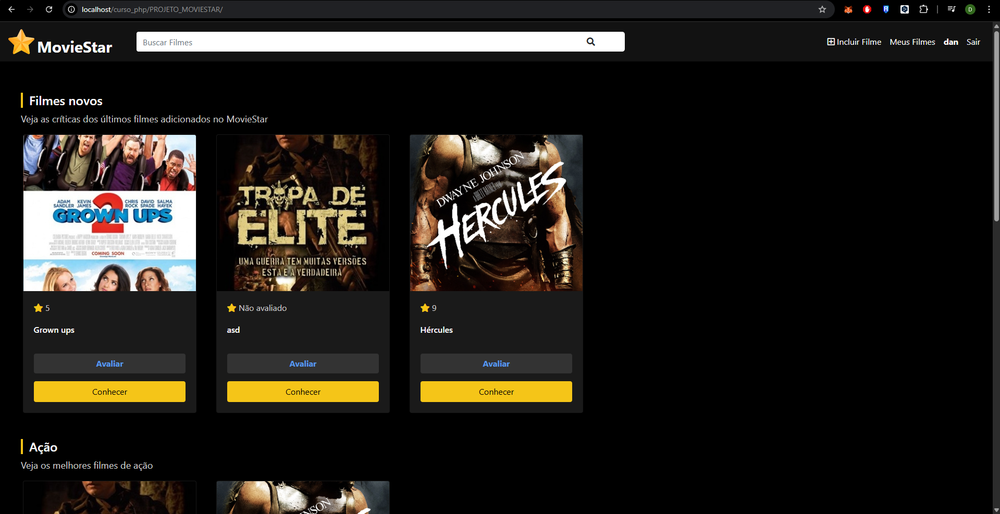
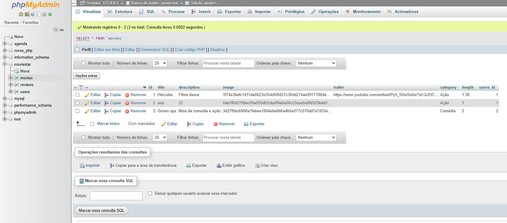

# Curso PHP

Este repositório foi criado como parte de um curso que estou fazendo para me aprofundar na linguagem PHP como estudante. Aqui você encontrará exemplos, exercícios e projetos desenvolvidos durante o aprendizado, organizados por temas para facilitar o estudo e consulta dos principais conceitos da linguagem.

## Estrutura do Projeto

- **Avançado_Arrays/**: Manipulação avançada de arrays, incluindo multidimensionais, ordenação, busca, divisão, união, e funções úteis como `reduce`, `compact`, `extract`.
- **Avançado_Strings/**: Operações com strings, como alteração de case, decomposição de URL, busca, repetição, conversão entre array e string, remoção de tags HTML, entre outros.
- **conceitos_basicos/**: Fundamentos do PHP, como variáveis, tipos de dados, arrays associativos, booleanos, objetos, palavras reservadas, instruções de código, etc.
- **DATAS/**: Manipulação de datas e horários, uso de funções como `date`, `strtotime`, `mktime`, e objetos `DateTime`.
- **design_patterns/**: Exemplos de padrões de projeto aplicados em PHP.
- **estrutura_repeticao/**: Estruturas de repetição como `for`, `foreach`, `while`, `do-while`, além de exercícios práticos.
- **estruturas_de_controle/**: Estruturas condicionais e de controle de fluxo.
- **expressao_operacao/**: Operadores e expressões em PHP.
- **EXTRA_HTML_CSS/**: Exemplos extras envolvendo HTML e CSS integrados ao PHP.
- **FUNCOES/**: Criação e uso de funções personalizadas.
- **inclusao_de_codigo/**: Exemplos de inclusão de arquivos e modularização.
- **LANDPAGE_TESTE/**: Testes e exemplos de landing page.
- **orientacao_objetos/**: Programação orientada a objetos em PHP.
- **PHP_MYSQL/**: Integração do PHP com banco de dados MySQL.
- **PHP_WEB/**: Exemplos de aplicações web com PHP.
- **PROJETO_AGENDA/**, **PROJETO_BLOG/**: Projetos completos desenvolvidos durante o curso.
- **PROJETO_MOVIESTAR/**: Projeto destaque por ser bem maior e mais complexo, contendo integração com banco de dados e diversas funcionalidades avançadas.

  
  
- **tipos_de_dados/**: Exemplos de diferentes tipos de dados em PHP.
- **variaveis/**: Exemplos de uso de variáveis.

## Requisitos
- PHP 7.4 ou superior
- Servidor local (XAMPP, WAMP, Laragon, etc)

